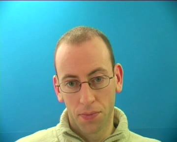
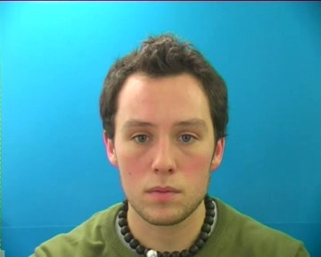
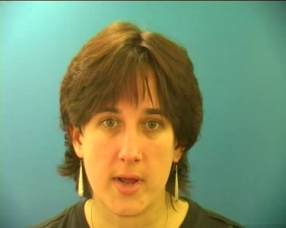

# FVTTS-demo (Interspeech 2024)

This demo page for "FVTTS : Face-based Voice synthesis for Text-To-Speech".

### Abstract
A face is expressive of individual identity and widely used in various studies such as identification, authentication, and personalization. A voice is also a means of expressing individuals, and personalized voice synthesis based on voice reference is active. However, the voice-based method faces voice sample dependency limitations. We propose **F**ace-based **V**oice synthesis for **T**ext-**T**o-**S**peech (FVTTS) to synthesize voice from face images that are more expressive of personal identity than voice samples. A major challenge is extracting distinct voice features highly related to voice from the face image. Our face encoder is designed to tackle this by integrating global image attributes with specific facial features that represent personalized voice characteristics. FVTTS has shown superiority in various metrics and demonstrated adaptability across different data domains. This study establishes a new standard in face-based TTS systems, leading the way in personalized voice synthesis.

## 1. Results on LRS3 dataset
FVTTS synthesize diverse voice of multi-Speaker Faces. 
With different face images of the same Speaker Face, FVTTS generate similar but not same voices. 
The synthetic results are shown in following samples. 

### Synthetic voice is synthesized with unseen face images:

|Text|Speaker Face|FaceTTS[1]|YourTTS[2]|Ours|GT|
|:---:|:---:|:---:|:---:|:---:|:---:|
|So when I started my job at the Arnold Foundation I came back to looking at a lot of these questions and I came back.||<video controls width="250"> <source src="./video/faceTTS/unseen/S0_I0_T7.mp4" type="video/mp4" /> </video>|<video controls width="250"> <source src="./video/yourTTS/unseen/S0_I0_T7.mp4" type="video/mp4" /> </video> |<video controls width="250"> <source src="./video/FVTTS/unseen/S0_I0_T7.mp4" type="video/mp4" /> </video> |<video controls width="250"> <source src="./video/GT/unseen/S0_I0_T7.mp4" type="video/mp4" /> </video>|
|So people hear about this study and they're like great if I want to get better at my job I just need to upgrade my browser.||<video controls width="250"> <source src="./video/faceTTS/unseen/S1_I0_T8.mp4" type="video/mp4" /> </video>|<video controls width="250"> <source src="./video/yourTTS/unseen/S1_I0_T8.mp4" type="video/mp4" /> </video> |<video controls width="250"> <source src="./video/FVTTS/unseen/S1_I0_T8.mp4" type="video/mp4" /> </video> |<video controls width="250"> <source src="./video/GT/unseen/S1_I0_T8.mp4" type="video/mp4" /> </video>|
|There's going to be a new system based on donated package tracking rechnology from the logistics company  that I work for.||<video controls width="250"> <source src="./video/faceTTS/unseen/S2_I0_T4.mp4" type="video/mp4" /> </video>|<video controls width="250"> <source src="./video/yourTTS/unseen/S2_I0_T4.mp4" type="video/mp4" /> </video> |<video controls width="250"> <source src="./video/FVTTS/unseen/S2_I0_T4.mp4" type="video/mp4" /> </video> |<video controls width="250"> <source src="./video/GT/unseen/S2_I0_T4.mp4" type="video/mp4" /> </video>|
|About a year after 911 researchers examined a group of women who were pregnant when they were exposed to the world.||<video controls width="250"> <source src="./video/faceTTS/unseen/S3_I0_T2.mp4" type="video/mp4" /> </video>|<video controls width="250"> <source src="./video/yourTTS/unseen/S3_I0_T2.mp4" type="video/mp4" /> </video> |<video controls width="250"> <source src="./video/FVTTS/unseen/S3_I0_T2.mp4" type="video/mp4" /> </video> |<video controls width="250"> <source src="./video/GT/unseen/S3_I0_T2.mp4" type="video/mp4" /> </video>|
|So people hear about this study and they're like great if I want to get better at my job I just need to upgrade my browser.||<video controls width="250"> <source src="./video/faceTTS/unseen/S5_I0_T8.mp4" type="video/mp4" /> </video>|<video controls width="250"> <source src="./video/yourTTS/unseen/S5_I0_T8.mp4" type="video/mp4" /> </video> |<video controls width="250"> <source src="./video/FVTTS/unseen/S5_I0_T8.mp4" type="video/mp4" /> </video> |<video controls width="250"> <source src="./video/GT/unseen/S5_I0_T8.mp4" type="video/mp4" /> </video>|
|And he said well I just care so deeply about my customers that I would never well them one of our crappy products.||<video controls width="250"> <source src="./video/faceTTS/unseen/S9_I0_T3.mp4" type="video/mp4" /> </video>|<video controls width="250"> <source src="./video/yourTTS/unseen/S9_I0_T3.mp4" type="video/mp4" /> </video> |<video controls width="250"> <source src="./video/FVTTS/unseen/S9_I0_T3.mp4" type="video/mp4" /> </video> |<video controls width="250"> <source src="./video/GT/unseen/S9_I0_T3.mp4" type="video/mp4" /> </video>|

### Synthetic voice is synthesized with seen face images:

|Text|Speaker Face|FaceTTS[1]|YourTTS[2]|Ours|GT|
|:---:|:---:|:---:|:---:|:---:|:---:|
|So people So people hear about this study and they're like great if I want to get better at my job I just need to upgrade my browser.||<video controls width="250"> <source src="./video/faceTTS/seen/S2_I0_T8.mp4" type="video/mp4" /> </video>|<video controls width="250"> <source src="./video/yourTTS/seen/S2_I0_T8.mp4" type="video/mp4" /> </video> |<video controls width="250"> <source src="./video/FVTTS/seen/S2_I0_T8.mp4" type="video/mp4" /> </video> |<video controls width="250"> <source src="./video/GT/seen/S2_I0_T8.mp4" type="video/mp4" /> </video>|
|And he was talking about the importance of coaching boys into men and changing the culture of the locker room and giving.||<video controls width="250"> <source src="./video/faceTTS/seen/S7_I1_T9.mp4" type="video/mp4" /> </video>|<video controls width="250"> <source src="./video/yourTTS/seen/S7_I1_T9.mp4" type="video/mp4" /> </video> |<video controls width="250"> <source src="./video/FVTTS/seen/S7_I1_T9.mp4" type="video/mp4" /> </video> |<video controls width="250"> <source src="./video/GT/seen/S7_I1_T9.mp4" type="video/mp4" /> </video>|
|We have ideas for how to make things better and I want to share three of them that we've picked up in our own work.||<video controls width="250"> <source src="./video/faceTTS/seen/S8_I2_T0.mp4" type="video/mp4" /> </video>|<video controls width="250"> <source src="./video/yourTTS/seen/S8_I2_T0.mp4" type="video/mp4" /> </video> |<video controls width="250"> <source src="./video/FVTTS/seen/S8_I2_T0.mp4" type="video/mp4" /> </video> |<video controls width="250"> <source src="./video/GT/seen/S8_I2_T0.mp4" type="video/mp4" /> </video>|

## 1. Results on Cross-Data

### GRID dataset

With GRID dataset, the out of distribution of seen dataset, we generate new voices.

|Text|Speaker Face|FaceTTS[1]|YourTTS[2]|Ours|GT|
|:---:|:---:|:---:|:---:|:---:|:---:|
|We have ideas for how to make things better and I want to share three of them that we've picked up in our own work.||<video controls width="250"> <source src="./video/faceTTS/grid/S0_I0_T0.mp4" type="video/mp4" /> </video>|<video controls width="250"> <source src="./video/yourTTS/grid/S0_I0_T0.mp4" type="video/mp4" /> </video> |<video controls width="250"> <source src="./video/FVTTS/grid/S0_I0_T0.mp4" type="video/mp4" /> </video> |<video controls width="250"> <source src="./video/GT/grid/S0_I0_T0.mp4" type="video/mp4" /> </video>|
|We have ideas for how to make things better and I want to share three of them that we've picked up in our own work.||<video controls width="250"> <source src="./video/faceTTS/grid/S1_I0_T0.mp4" type="video/mp4" /> </video>|<video controls width="250"> <source src="./video/yourTTS/grid/S1_I0_T0.mp4" type="video/mp4" /> </video> |<video controls width="250"> <source src="./video/FVTTS/grid/S1_I0_T0.mp4" type="video/mp4" /> </video> |<video controls width="250"> <source src="./video/GT/grid/S1_I0_T0.mp4" type="video/mp4" /> </video>|
|We have ideas for how to make things better and I want to share three of them that we've picked up in our own work.||<video controls width="250"> <source src="./video/faceTTS/grid/S3_I1_T0.mp4" type="video/mp4" /> </video>|<video controls width="250"> <source src="./video/yourTTS/grid/S3_I1_T0.mp4" type="video/mp4" /> </video> |<video controls width="250"> <source src="./video/FVTTS/grid/S3_I1_T0.mp4" type="video/mp4" /> </video> |<video controls width="250"> <source src="./video/GT/grid/S3_I1_T0.mp4" type="video/mp4" /> </video>|

### Animation dataset

To apply FVTTS to animation images, we synthesize voice of animation characters.
We select the human-like character images from  open access video sharing platform YouTube.
Note that the model is trained for generate human voice, so that the characters' voices do not similar to their original voices.

|Text|Speaker Face|FaceTTS[1]|Ours|
|:---:|:---:|:---:|:---:|
|You should see these places, I mean there are a whole world outside of books and maps.||<video controls width="250"> <source src="./video/faceTTS/ani/al.mp4" type="video/mp4" /> </video> |<video controls width="250"> <source src="./video/FVTTS/ani/al.mp4" type="video/mp4" /> </video>
|You should see these places, I mean there are a whole world outside of books and maps.||<video controls width="250"> <source src="./video/faceTTS/ani/sul.mp4" type="video/mp4" /> </video> |<video controls width="250"> <source src="./video/FVTTS/ani/sul.mp4" type="video/mp4" /> </video>
|You don't have to live in fear, cause for the first time in forever I will be right there.||<video controls width="250"> <source src="./video/faceTTS/ani/anna.mp4" type="video/mp4" /> </video> |<video controls width="250"> <source src="./video/FVTTS/ani/anna.mp4" type="video/mp4" /> </video>
|Every day's a little harder as I feel my power grow. Don't you know there's part of me that longs to go into the unknown?||<video controls width="250"> <source src="./video/faceTTS/ani/elsa2.mp4" type="video/mp4" /> </video> |<video controls width="250"> <source src="./video/FVTTS/ani/elsa2.mp4" type="video/mp4" /> </video>
|But is this what it feels like to be growing apart. When did I become the one who’s always chasing your heart||<video controls width="250"> <source src="./video/faceTTS/ani/christ.mp4" type="video/mp4" /> </video> |<video controls width="250"> <source src="./video/FVTTS/ani/christ.mp4" type="video/mp4" /> </video>
|There is nowhere you could go that I won't be with you and you will do wondrous thing.||<video controls width="250"> <source src="./video/faceTTS/ani/mo2.mp4" type="video/mp4" /> </video> |<video controls width="250"> <source src="./video/FVTTS/ani/mo2.mp4" type="video/mp4" /> </video>

[1] Lee, J., Chung, J. S., & Chung, S. W. (2023, June). Imaginary Voice: Face-Styled Diffusion Model for Text-to-Speech. In ICASSP 2023-2023 IEEE International Conference on Acoustics, Speech and Signal Processing (ICASSP) (pp. 1-5). IEEE.

[2] Casanova, E., Weber, J., Shulby, C. D., Junior, A. C., Gölge, E., & Ponti, M. A. (2022, June). Yourtts: Towards zero-shot multi-Speaker Face tts and zero-shot voice conversion for everyone. In International Conference on Machine Learning (pp. 2709-2720). PMLR.
